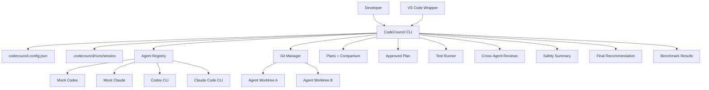

# CodeCouncil

**CodeCouncil is a local TypeScript CLI that coordinates multiple AI coding agents in isolated git worktrees, then compares plans, tests implementations, cross-reviews diffs, and produces an auditable recommendation.**

It starts with OpenAI Codex CLI and Anthropic Claude Code CLI, with mock agents for demos/tests and an adapter architecture for future agents such as Gemini, Aider, Cursor, Copilot, or local models.

## Problem

AI coding tools are powerful, but running more than one agent on the same repository is messy:

- agents overwrite the same working directory
- plans and diffs are hard to compare
- tests and reviews happen inconsistently
- agent confidence is often mistaken for evidence
- safety depends on ad hoc human discipline

CodeCouncil treats agents as collaborators in a controlled local workflow. Each agent gets its own branch and worktree. The CLI preserves artifacts, runs tests, asks agents to review each other, and leaves final application to the human developer.

## Why This Exists

This project is both a developer tool and a research platform. It asks a concrete AI engineering question:

> Does structured multi-agent collaboration improve software engineering outcomes compared with one agent working alone?

CodeCouncil does not claim the answer yet. Benchmark mode creates the data pipeline needed to measure it.

## What Works Today

- TypeScript CLI with strict settings and tests.
- Config validation with zod.
- Mock Codex/Claude agents for reproducible local demos.
- Real Codex CLI and Claude Code CLI adapters through configurable child processes.
- Session model with JSONL event logs and durable artifacts.
- Plan comparison and approval flow.
- Isolated git worktrees and branches per agent.
- Implementation, test, cross-review, safety summary, scoring, and final report stages.
- Guided `solve` workflow and `resume` command.
- Benchmark mode for comparing single-agent and two-agent strategies.
- Minimal VS Code extension wrapper around the CLI.

CodeCouncil does **not** automatically merge, push, publish, or apply agent changes.

## Architecture



## Installation

Requirements:

- Node.js 20.11+
- pnpm 9+
- git
- Optional: authenticated `codex` and/or `claude` CLIs for real-agent runs

```bash
pnpm install
pnpm build
pnpm link --global
codecouncil --help
```

For source development:

```bash
pnpm dev -- --help
```

## Quickstart With Mock Agents

The demo uses mock agents, so it does not call Codex or Claude.

```bash
cd examples/demo-repo
git init
git symbolic-ref HEAD refs/heads/main
git add .
git commit -m "initial demo app"

codecouncil init
codecouncil plan "Add password complexity validation" --agents mock-codex,mock-claude
codecouncil sessions list
codecouncil approve --session <session-id> --agent mock-codex
codecouncil implement --session <session-id> --agents mock-codex,mock-claude
codecouncil test --session <session-id> --agents mock-codex,mock-claude
codecouncil review --session <session-id> --reviewers mock-codex,mock-claude --targets mock-codex,mock-claude
codecouncil safety --session <session-id>
codecouncil report --session <session-id>
codecouncil apply --session <session-id> --agent mock-codex --dry-run
```

## Example Terminal Output

```text
Planning complete.
Task: Add password complexity validation
Session: 20260701-214210-add-password-complexity-validation

Plans:
- mock-codex: Add a focused validation layer with tests.
- mock-claude: Keep validation close to the signup boundary and test edge cases.

Major agreements:
- All selected agents produced structured plans.

Suggested implementation agent:
- mock-codex
```

```text
Final report generated.
Recommendation: recommend_agent_solution: mock-codex
Reason: mock-codex passed tests.
Report: .codecouncil/runs/.../reports/final-report.md
Next manual commands:
- codecouncil apply --session ... --agent mock-codex --dry-run
- cd .codecouncil/runs/.../worktrees/mock-codex
- git status
```

## Core Commands

```bash
codecouncil init
codecouncil doctor
codecouncil models list
codecouncil plan "task" --agents codex,claude
codecouncil approve --session <id> --agent codex
codecouncil implement --session <id> --agents codex,claude
codecouncil test --session <id> --agents codex,claude
codecouncil review --session <id> --reviewers codex,claude --targets codex,claude
codecouncil safety --session <id>
codecouncil report --session <id>
codecouncil solve "task" --agents codex,claude
codecouncil benchmark --tasks tasks.json --agents codex,claude --yes
```

## Model Selection

Use `codecouncil models list` to see recommended model choices before spending real-agent tokens.

Set model defaults in `codecouncil.config.json`, or override per run:

```bash
codecouncil plan "task" --agents codex,claude --models codex=gpt-5.4-mini,claude=sonnet
codecouncil review --session <id> --reviewers codex,claude --targets codex,claude --models codex=gpt-5.5,claude=fable
```

CodeCouncil passes model choices to the official CLIs. The provider CLI decides whether the selected model is available for your account.

## Safety Model

CodeCouncil is designed for defense-in-depth, not perfect sandboxing.

- Implementation runs only inside agent-specific git worktrees.
- An approved plan is required before implementation unless explicitly bypassed.
- Sensitive paths such as `.env`, private keys, credentials, `.git`, `node_modules`, and CodeCouncil internals are blocked or warned on.
- Test commands are configured/detected and run without shell interpolation.
- Dangerous command text is flagged in artifacts and reports.
- Prompt guardrails warn agents about repository prompt injection.
- Logs are redacted for common secret patterns.
- `apply` is dry-run only in this version.

See [docs/safety.md](docs/safety.md) and [SECURITY.md](SECURITY.md).

## Benchmarking

Benchmark mode runs strategy comparisons across a task file and writes:

```text
benchmark/<run-id>/results.jsonl
benchmark/<run-id>/summary.json
benchmark/<run-id>/summary.md
benchmark/<run-id>/table.csv
```

Example:

```bash
codecouncil benchmark \
  --tasks examples/benchmark.tasks.json \
  --agents mock-codex,mock-claude \
  --strategies codex_only,codex_then_claude_review,both_implement_then_review_and_select
```

Real-agent benchmark runs require `--yes`.

## VS Code Extension

The extension in `packages/vscode-extension` is a thin wrapper around the CLI. It adds commands for init, doctor, planning, sessions, latest reports, latest plan comparison, and resume. It does not control Codex or Claude VS Code extensions.

See [docs/vscode-extension.md](docs/vscode-extension.md).

## Documentation

- [Getting Started](docs/getting-started.md)
- [Configuration](docs/configuration.md)
- [Workflow](docs/workflow.md)
- [Safety](docs/safety.md)
- [VS Code Extension](docs/vscode-extension.md)
- [Benchmarking](docs/benchmarking.md)
- [Architecture](docs/architecture.md)
- [Demo Script](docs/demo-script.md)
- [Portfolio Copy](docs/portfolio-copy.md)

## Roadmap

- Safer non-dry-run apply flow with explicit approvals.
- Better structured parsing for real Codex and Claude outputs.
- HTML benchmark dashboard with charts.
- More benchmark fixtures and manually labeled datasets.
- Additional adapters for other coding agents.
- Richer VS Code session browser.
- Optional container/sandbox integration for higher-risk repositories.

## Limitations

- This is an early project scaffold, not a security sandbox.
- Real-agent behavior depends on installed/authenticated local CLIs.
- Benchmark results are only meaningful after representative tasks and human labels.
- Cross-agent review can miss bugs and should not replace human review.
- The VS Code extension is intentionally minimal and delegates to the CLI.

## Contributing

Contributions are welcome. Start with [CONTRIBUTING.md](CONTRIBUTING.md), run the verification suite, and keep safety boundaries explicit.

```bash
pnpm typecheck
pnpm test
pnpm lint
pnpm build
```

## License

MIT. See [LICENSE](LICENSE).
