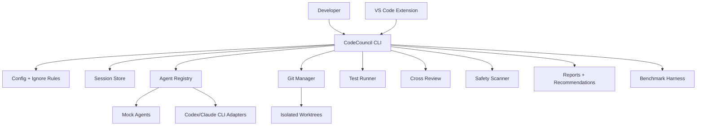

# Architecture

CodeCouncil is a local-first TypeScript CLI with a thin VS Code wrapper.

The CLI owns all workflow logic. Editor integrations should call the CLI rather than duplicate orchestration.

## High-Level Diagram



## Source Layout

```text
src/
  agents/          agent interface, mocks, CLI adapters, plan persistence
  benchmark/       task validation, strategy execution, metrics, summaries
  commands/        Commander command modules
  config/          zod schemas, defaults, config discovery
  core/            shared errors, redaction, agent selection
  git/             repository and worktree management
  ignore/          .codecouncilignore parser/loader
  implementation/  implementation artifact persistence
  report/          final recommendation and markdown rendering
  review/          pair generation, aggregation, review persistence
  safety/          sensitive path and risky command checks
  scoring/         deterministic implementation scoring
  session/         session schemas, event logging, approvals
  testing/         test detection, execution, persistence
  workflow/        reusable planning and solve/resume state
packages/
  vscode-extension/
```

## Session Layout

```text
.codecouncil/runs/<session-id>/
  task.json
  events.jsonl
  workflow.json
  approved-plan.json
  approved-plan.md
  plans/
  worktrees/
  diffs/
  runs/
  reviews/
  tests/
  scores/
  safety/
  reports/
```

## Agent Boundary

Agents implement:

- `checkAvailability`
- `generatePlan`
- `implementTask`
- `reviewDiff`

Real adapters call official local CLIs through child processes. CodeCouncil does not read token files and does not ask for credentials.

## Recommendation Model

The report recommends what the user should inspect next. It weighs:

- implementation success
- tests, with the highest score weight
- safety warnings
- review findings
- changed-file count
- diff size

The recommendation is advisory and never automatically merges code.

For the longer architecture narrative, see [../ARCHITECTURE.md](../ARCHITECTURE.md).
